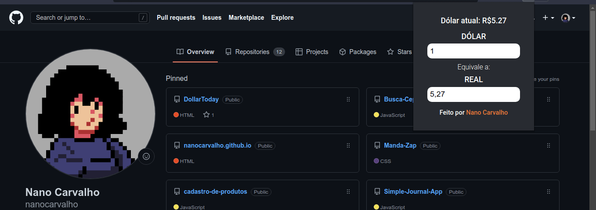

## Uma simples extensão que mostra o valor do dólar atual!

Caso queira testar:
- Vá para a aba de extensões do chrome
- Habilite o modo desenvolvedor
- Baixe / Clone o repositório
- Cliquem em "carregar sem compactação" e escolha a pasta da extensão
	

