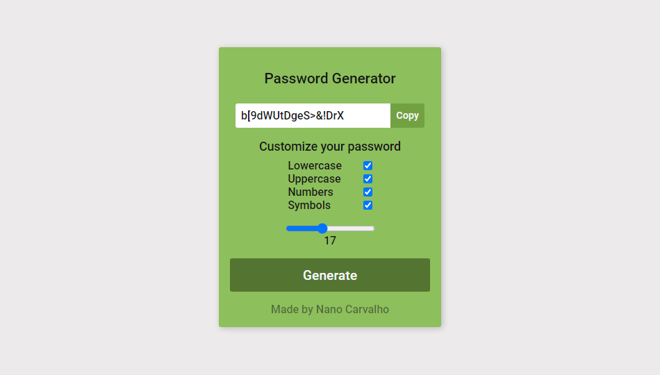

## A Simple password generator using react + nanoid
With this project, I'm trying to get better at passing values between components.
I used the nanoid library to generate a more secure password, instead of the Math.random() method.
The design is kinda ugly, but works for now haha ~~I'll update this in the future once I learn design, this can take some time~~

[Online Version](https://react-password-generator.pages.dev/)

- Used in this project:
     - React
     - CSS
     - [Nanoid](https://github.com/ai/nanoid)

